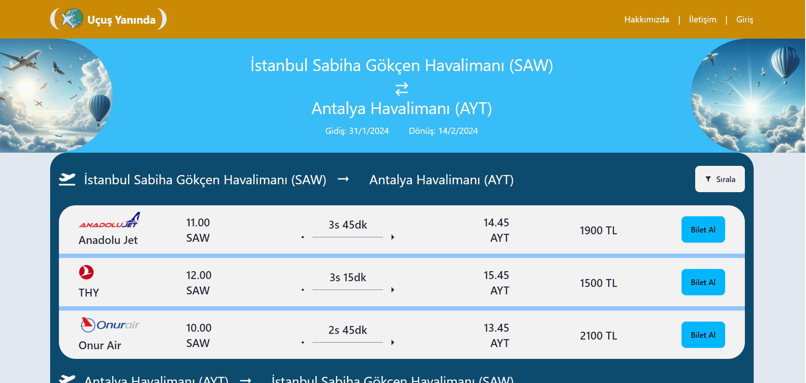
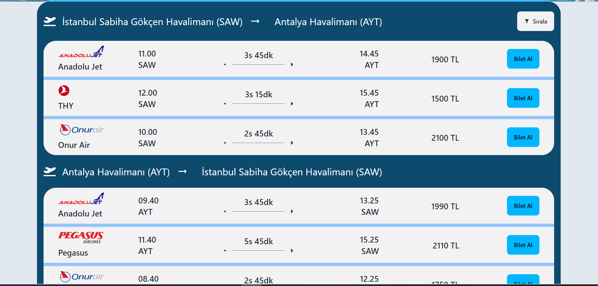
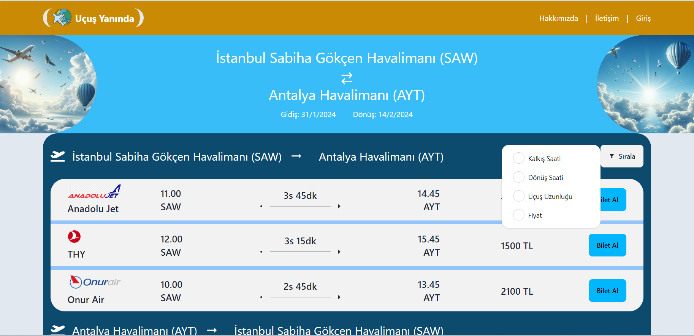
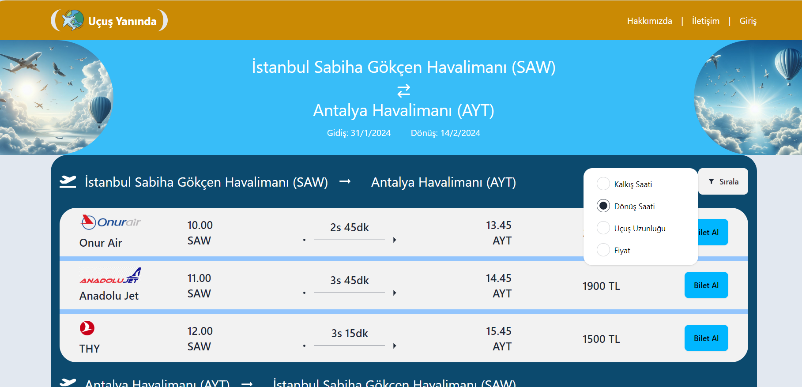
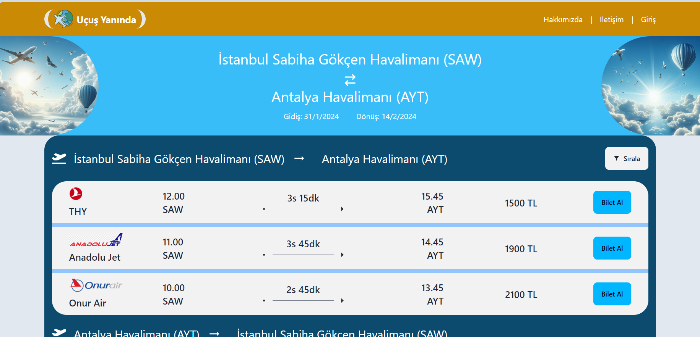
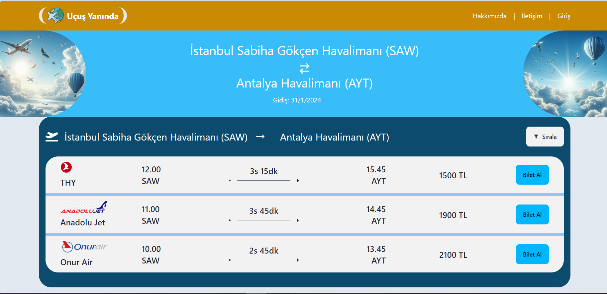
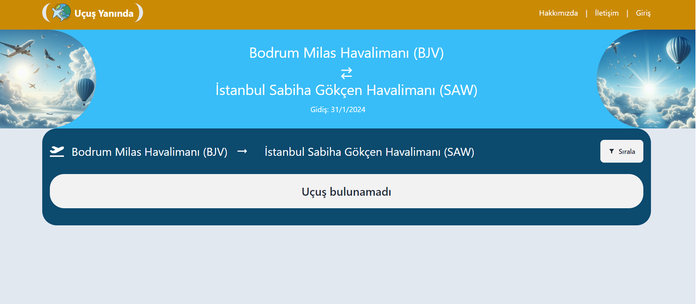

# Flight Search Application

Bu projenin amacı, bir uçuş arama uygulaması için frontend application geliştirmektir..


## Proje Hakkında
Projenin temel amacı bir uçuş arama uygulaması gerçeklemek olsa da, göründüğünden çok daha eğitici ve zorlu bir proje olduğunu söyleyebilirim. Bu projeyi geliştirirken birçok yeni araç kullandım, yeni teknolojiler öğrendim ve zorlu sorunları çözdüm. 
  
## Özellikler

 #### Arama Özelliği
-  Kalkış havaalanı, varış havaalanı, kalkış tarihi, dönüş tarihi seçilebilen bir arama kutusu yapılmalı
- “Tek yönlü uçuş” olduğunu belirten bir seçenek olmalı. Bu seçildiyse dönüş tarihi girilmemeli.
- Dönen sonuçlar listelenmeli.
- Kalkış ve varış havaalanı input kutularında yazıldığı anda havaalanları koda ve şehre göre search edilmeli ve uygun olanlar listelenmeli.
- Kalkış ve dönüş tarihi input kutularında datepicker kullanılmalı.
- Tüm alanların validasyonu yapılmalı

#### Listeleme Özelliği
- Listelenen uçuşlar kalkış saati, dönüş saati, uçuş uzunluğu, ya da fiyata göre sıralanabilmeli
- Sunucudan cevap gelene kadar kullanıcıya “yükleniyor” animasyonu gösterilmeli
- Listelenen uçuşların detay bilgileri gösterilmeli (havayolu, şehir, vs.)
#### Hata kontrolü
- Sunucudan gelen tüm hata durumları handle edilmeli
#### Mock Data
- Tüm API istekleri için bir mock API ve mock data oluşturulmalı. Frontend buna yapılan istekler üzerinden çalışmalı.
#### Boş data kontrolü 
- Sunucudan boş data gelmesi durumu handle edilmeli
#### Framework
- React ile yapılmalı
#### Git versiyon sistemi kullanılmalı 
- Proje Git ve Github Desktop kullanılarak GitHub’a yüklenilecek.


  
## API Kullanımı
Projede mock api olarak json-web server kullanılmıştır. Mock'lanmış veriler oluşturulup mock server'a istek atılarak veriler çekilmiştir.

#### Input seçim alanları için havalimanlarını getir

```http
  GET /api/airports
```

#### Seçilmiş bilgilere uygun uçuşları listele

```http
  GET /api/flights
```

  
## Bilgisayarınızda Çalıştırın

Projeyi klonlayın

```bash
  git clone https://github.com/altundalyusuf/Flight-Search-Application.git
```

Proje dizinine gidin

```bash
  cd flight-search-application

```

Gerekli paketleri yükleyin

```bash
  npm install
```

Mock Sunucuyu çalıştırın

```bash
  npm run server
```
Frontend tarafını çalıştırın

```bash
  npm run dev
```

  
## Ekran Görüntüleri










  
## Kullanılan Teknolojiler

**İstemci:** React, Redux Toolkit, Session Storage, TailwindCSS, Daisy UI, Vite, Axios, react-datepicker, react-router-dom, react-icons, react-select, react-toastify, eslint, prettier

**Sunucu:** Json Web Server (Mocking Data)

**Yapay Zeka Araçları:** Github Copilot, Amazon CodeWhisperer, Chat GPT, Bing Chat 

**Diğer Araçlar:** Logolar ve tasarımlar için Canva, 

  
## Çıkarılan Dersler

Bu projeyi inşa ederken bir noktada algoritma ve yapı kurgusu çok karışmasına rağmen yardımcı olarak kullandığım bir sürü yeni aracın da desteğiyle projeyi tamamlayabildim. Projenin bana en büyük katkısı bu yeni teknolojileri kullanma fırsatı sağlaması olmuştur.

  